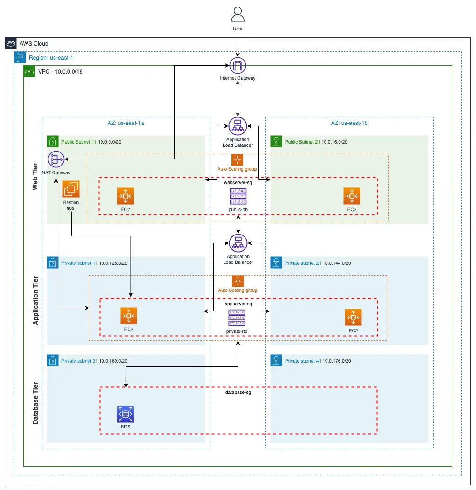

# Azure-3-tier-Architecture

This repository contains Terraform code for deploying a 3-tier architecture on Azure.

The diagram above illustrates the architecture deployed by the Terraform code.

#Note that the architecture image is of AWS but the infra created and deployed is on Azure
